# 执行计划 — ClipSmart（Mac 智能剪切板）

## 详细分析摘要

### 变更影响评估
| 维度 | 评估结果 |
|------|---------|
| **用户端变更** | 是 — 全新用户交互应用（热键、面板、历史、设置） |
| **结构变更** | 是 — 全新 macOS 原生应用，3 层架构 |
| **数据模型变更** | 是 — 全新数据模型（ClipboardItem + 持久化） |
| **API 变更** | 否 — 无对外 API，仅调用系统 API |
| **NFR 影响** | 是 — 严格的性能要求（CPU/内存/响应时延） |

### 风险评估
| 项目 | 等级 |
|------|------|
| **风险等级** | 中等 |
| **回滚复杂度** | 低（独立 .app，本地数据） |
| **测试复杂度** | 中等（需要模拟系统剪切板、全局热键、持久化） |

### 主要技术挑战
- macOS 全局热键注册（需绕过沙盒或特殊处理）
- NSPasteboard 持续监听而不影响系统性能
- SwiftUI + macOS 26 Liquid Glass 材质效果实现
- 图片数据的存储与懒加载优化

---

## 工作流可视化

```mermaid
flowchart TD
    Start(["用户请求"])

    subgraph INCEPTION["INCEPTION 阶段"]
        WD["工作区检测\nCOMPLETED"]
        RE["逆向工程\nSKIPPED"]
        RA["需求分析\nCOMPLETED"]
        US["用户故事\nSKIPPED"]
        WP["工作流规划\nIN PROGRESS"]
        AD["应用设计\nEXECUTE"]
        UG["单元生成\nEXECUTE"]
    end

    subgraph CONSTRUCTION["CONSTRUCTION 阶段"]
        FD["功能设计\nEXECUTE"]
        NFRA["NFR 需求\nEXECUTE"]
        NFRD["NFR 设计\nEXECUTE"]
        ID["基础设施设计\nSKIPPED"]
        CG["代码生成\nEXECUTE"]
        BT["构建与测试\nEXECUTE"]
    end

    subgraph OPERATIONS["OPERATIONS 阶段"]
        OPS["运维\nPLACEHOLDER"]
    end

    Start --> WD
    WD --> RE
    WD --> RA
    RE -.->|跳过| RA
    RA --> US
    US -.->|跳过| WP
    RA --> WP
    WP --> AD
    AD --> UG
    UG --> FD
    FD --> NFRA
    NFRA --> NFRD
    NFRD --> ID
    ID -.->|跳过| CG
    NFRD --> CG
    CG --> BT
    BT -.-> OPS
    BT --> End(["完成"])

    style WD fill:#4CAF50,stroke:#1B5E20,stroke-width:3px,color:#fff
    style RA fill:#4CAF50,stroke:#1B5E20,stroke-width:3px,color:#fff
    style WP fill:#FFA726,stroke:#E65100,stroke-width:3px,color:#000
    style AD fill:#FFA726,stroke:#E65100,stroke-width:3px,stroke-dasharray:5 5,color:#000
    style UG fill:#FFA726,stroke:#E65100,stroke-width:3px,stroke-dasharray:5 5,color:#000
    style FD fill:#FFA726,stroke:#E65100,stroke-width:3px,stroke-dasharray:5 5,color:#000
    style NFRA fill:#FFA726,stroke:#E65100,stroke-width:3px,stroke-dasharray:5 5,color:#000
    style NFRD fill:#FFA726,stroke:#E65100,stroke-width:3px,stroke-dasharray:5 5,color:#000
    style CG fill:#4CAF50,stroke:#1B5E20,stroke-width:3px,color:#fff
    style BT fill:#4CAF50,stroke:#1B5E20,stroke-width:3px,color:#fff
    style RE fill:#BDBDBD,stroke:#424242,stroke-width:2px,stroke-dasharray:5 5,color:#000
    style US fill:#BDBDBD,stroke:#424242,stroke-width:2px,stroke-dasharray:5 5,color:#000
    style ID fill:#BDBDBD,stroke:#424242,stroke-width:2px,stroke-dasharray:5 5,color:#000
    style OPS fill:#BDBDBD,stroke:#424242,stroke-width:2px,stroke-dasharray:5 5,color:#000
    style Start fill:#CE93D8,stroke:#6A1B9A,stroke-width:3px,color:#000
    style End fill:#CE93D8,stroke:#6A1B9A,stroke-width:3px,color:#000
    style INCEPTION fill:#BBDEFB,stroke:#1565C0,stroke-width:3px,color:#000
    style CONSTRUCTION fill:#C8E6C9,stroke:#2E7D32,stroke-width:3px,color:#000
    style OPERATIONS fill:#FFF59D,stroke:#F57F17,stroke-width:3px,color:#000

    linkStyle default stroke:#333,stroke-width:2px
```

---

## 执行阶段详情

### 🔵 INCEPTION 阶段

| 阶段 | 状态 | 理由 |
|------|------|------|
| 工作区检测 | ✅ COMPLETED | 已完成 |
| 逆向工程 | ⬛ SKIPPED | Greenfield 项目，无现有代码 |
| 需求分析 | ✅ COMPLETED | 已完成，10 项功能需求 + 5 项 NFR |
| 用户故事 | ⬛ SKIPPED | 需求文档已包含完整用户场景，单人开发，无需团队协作文档 |
| 工作流规划 | 🔄 IN PROGRESS | 当前阶段 |
| 应用设计 | 🟠 EXECUTE | 全新多组件应用，需定义 3 层架构和组件职责 |
| 单元生成 | 🟠 EXECUTE | 应用分 3 个独立开发单元（Core / UI / AppShell） |

### 🟢 CONSTRUCTION 阶段

| 阶段 | 状态 | 理由 |
|------|------|------|
| 功能设计 | 🟠 EXECUTE | FIFO 淘汰逻辑、固定记录、内容类型处理等业务逻辑复杂 |
| NFR 需求 | 🟠 EXECUTE | 严格性能指标（CPU < 0.5%、内存 < 50MB、延迟 < 100ms） |
| NFR 设计 | 🟠 EXECUTE | 需要设计后台监听架构、懒加载、节流策略 |
| 基础设施设计 | ⬛ SKIPPED | 独立 macOS 应用，无云基础设施，.dmg 打包无需专项设计 |
| 代码生成 | 🟢 EXECUTE | 必执行 |
| 构建与测试 | 🟢 EXECUTE | 必执行 |

---

## 拟定开发单元

### Unit 1 — Core（核心层）
**职责**: 数据模型、剪切板监听、历史记录存储与持久化
- `ClipboardItem` — 数据模型（文本/图片/文件，时间戳，固定标记）
- `ClipboardMonitor` — NSPasteboard 监听服务
- `HistoryStore` — 历史记录管理（FIFO、固定、SwiftData 持久化）

### Unit 2 — UI（界面层）
**职责**: 主面板、记录列表、搜索栏、Liquid Glass 视觉效果
- `MainPanelView` — 浮动窗口主视图
- `ClipItemView` — 单条历史记录 Cell
- `SearchBarView` — 实时搜索输入框
- `ClipItemContextMenu` — 右键菜单

### Unit 3 — AppShell（应用外壳层）
**职责**: 应用生命周期、菜单栏、全局热键、偏好设置
- `AppDelegate` — 应用启动与生命周期
- `MenuBarManager` — 菜单栏图标与菜单
- `HotkeyManager` — 全局快捷键注册
- `SettingsView` — 偏好设置面板
- `PreferencesStore` — 用户配置持久化

---

## 成功标准
- **主要目标**: 完整可运行的 macOS 剪切板管理器 .dmg 安装包
- **核心交付物**: .app 应用、.dmg 安装包、构建说明
- **质量门控**: 
  - 后台 CPU < 0.5%
  - 面板唤起 < 100ms
  - 历史记录跨重启持久化
  - 全局热键在任意应用下生效
